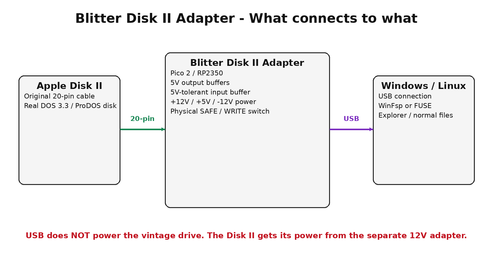

# Blitter Disk II Adapter

**Original Apple Disk II drive to modern Windows/Linux PC over USB**  
**Project conceived and directed by Darren Crawford (Viper)**



## What this project is

The **Blitter Disk II Adapter** is an open-development hardware project intended to connect an original Apple Disk II 5.25-inch floppy drive to a modern computer over USB.

The long-term goal is more ambitious than simple disk imaging: a real **DOS 3.3 or ProDOS floppy should be mountable as a live filesystem** on Windows or Linux so files can be copied, opened, renamed, deleted, and written back to the physical Apple II disk.

The adapter is designed around an **RP2350 / Raspberry Pi Pico 2**, 5 V logic buffering, a dedicated vintage-drive power section, and the original Disk II 20-pin ribbon connector.

## Current status

**Revision B is a prototype hardware/documentation release. It is not yet bench-qualified on an original Disk II.**

Completed in Rev B:

- beginner-oriented build manual
- complete point-to-point wiring table
- Disk II 20-pin connector map
- +12 V, +5 V and -12 V power architecture
- 3.3 V-to-5 V output buffering
- 5 V-tolerant drive-to-RP2350 input buffering
- hardware SAFE/WRITE interlock concept
- bill of materials
- wiring and architecture diagrams
- staged bring-up and multimeter checks

Not yet completed:

- physical prototype validation on a real Disk II
- PCB/KiCad production design
- RP2350 drive-control firmware
- USB host protocol implementation
- DOS 3.3 filesystem driver
- ProDOS filesystem driver
- Windows WinFsp live-mount driver
- Linux FUSE live-mount driver

See [STATUS.md](STATUS.md) and [ROADMAP.md](ROADMAP.md).

## Start here

If you are building the hardware for the first time, read:

**[Rev B Beginner Build Manual (PDF)](docs/Blitter_Disk_II_Adapter_RevB_Beginner_Build_Manual.pdf)**

The editable Word version is also included in `docs/`.

For quick reference:

- [Bill of Materials](hardware/Blitter_Disk_II_Adapter_RevB_BOM.csv)
- [Point-to-Point Wiring](hardware/Blitter_Disk_II_Adapter_RevB_Point_to_Point_Wiring.csv)
- [Safety / Bring-up Rules](SAFETY.md)

## Target architecture

```text
Original Apple Disk II
        |
        | 20-pin ribbon cable
        v
+----------------------------+
| BLITTER DISK II ADAPTER    |
|                            |
| RP2350 / Pico 2            |
| 5 V output buffers         |
| 5 V-tolerant input buffer  |
| +12 V / +5 V / -12 V PSU  |
| physical WRITE interlock   |
+-------------+--------------+
              |
              | USB
              v
+----------------------------+
| Windows / Linux host       |
|                            |
| USB daemon                 |
| DOS 3.3 / ProDOS layer     |
| WinFsp or FUSE             |
+-------------+--------------+
              |
              v
     A:\  or  /media/appleii
```

## Intended user experience

Eventually, inserting a real floppy should make it possible to do something like:

### Windows

```text
Apple II Disk (A:)
  HELLO
  BASIC.SYSTEM
  GAMES
  README
```

### Linux

```bash
ls /media/appleii
cp /media/appleii/HELLO ~/AppleII-Backup/
```

For DOS 3.3, the mounted volume will remain a flat directory because DOS 3.3 itself does not support subdirectories. ProDOS volumes can expose real ProDOS folders.

## Hardware documentation

The ten Rev B diagrams are in [`hardware/diagrams/`](hardware/diagrams/):

1. architecture
2. Disk II connector
3. Pico 2 pins used
4. power wiring
5. output buffers
6. output-enable safety
7. SAFE/WRITE switch
8. input buffer
9. grounding and decoupling
10. complete wiring map

Revision A is retained under [`hardware/archive/`](hardware/archive/) for historical reference only. **Use Rev B as the current design reference.**

## Important safety warning

The Disk II connector carries **+12 V, +5 V and -12 V alongside logic signals**. A reversed or incorrectly wired cable can damage vintage hardware.

**Do not connect an original Disk II until every rail and idle logic state has been verified with a multimeter. Never hot-plug the 20-pin Disk II cable.**

Read [SAFETY.md](SAFETY.md) before building.

## Project credit

**Blitter Disk II Adapter**  
**Project conceived and directed by Darren Crawford (Viper)**

When sharing, mirroring, discussing, or building from this project, please retain this project credit.

## Licensing

No general open-source/open-hardware license has been selected for this prototype repository yet. See [LICENSING.md](LICENSING.md) before redistributing modified versions.

## Repository release

Suggested GitHub repository name:

`Blitter-Disk-II-Adapter`

Suggested first public tag:

`rev-b-prototype`

Suggested release title:

`Blitter Disk II Adapter - Revision B Prototype Documentation`
